# BOCONIC — TOÀN BỘ FLOWCHART VÀ LOGIC CHART

Ngày 01/10/2026 · Thiết kế to-be · 33 sơ đồ liên kết.

Nguồn: BOCONIC_Master_Prompt.md, BOCONIC_Update_Request_Library_Prompt.md và BOCONIC_Chapter_Update_Workflow_Audit_Prompt.md trong cuộc trao đổi này. Đây là bản thiết kế nghiệp vụ đã thống nhất, chưa là audit as-is hoặc xác nhận các chức năng đã có trong repository ứng dụng.

## Cách đọc

- F00: bản đồ nghiệp vụ tổng quan; F30: kiến trúc ứng dụng.
- Hình thoi: điều kiện/nhánh. Hình trụ: ghi dữ liệu hoặc transaction. Khung đôi: quy trình được giải ở sơ đồ Fxx.
- Hình oval: bắt đầu hoặc dừng luồng đang xét, bao gồm dừng để chờ; không tự mang nghĩa giao dịch đã hoàn tất.
- Các bước xác nhận không áp đặt thứ tự gửi bắt buộc; service thu đủ confirmations, kiểm tra actor/state và chỉ chuyển trạng thái một lần.
- F14 và F25 là mở rộng P1; AI/OCR trong F02/F22 là tùy chọn P2; assembly ở F16 có rights gate riêng.
- SVG và Mermaid được sinh từ cùng danh sách nodes/edges. SVG đã render và kiểm tra; source Mermaid dùng cú pháp flowchart chuẩn và được kiểm tra cấu trúc/IDs/branches, chưa chạy qua native Mermaid parser trong môi trường này.

## Mục lục

| ID | Sơ đồ | Nhóm |
| --- | --- | --- |
| F00 | Bản đồ nghiệp vụ toàn dự án | Tổng quan |
| F01 | Đăng ký, xác thực và phân quyền | Tổng quan |
| F02 | Thêm sách, phân biệt edition và copy | Sách và thư viện |
| F03 | Thư viện cá nhân và thư viện cộng đồng | Sách và thư viện |
| F04 | User đề xuất và admin duyệt chương | Sách và thư viện |
| F05 | Khai báo coverage, file theo chương và publication | Sách và thư viện |
| F06 | Tiến độ học, bookmark và ghi chú riêng | Sách và thư viện |
| F07 | Tìm sách và tạo Need theo sách hoặc chương | Nhu cầu và matching |
| F08 | Eligibility, mọi owner phù hợp và thông báo | Nhu cầu và matching |
| F09 | Owner hỗ trợ, requester chọn Offer | Nhu cầu và matching |
| F10 | BorrowRequest, chấp nhận và giữ chỗ atomic | Mượn và trả |
| F11 | Hẹn giao, hai bên xác nhận và bắt đầu Loan | Mượn và trả |
| F12 | Đề nghị trả, xác nhận và mở khả dụng | Mượn và trả |
| F13 | Nhắc hạn, quá hạn và gia hạn | Mượn và trả |
| F14 | Cho mượn dây chuyền có owner consent | Mượn và trả |
| F15 | Logic đáp ứng Need và phần còn thiếu | Nhu cầu và matching |
| F16 | Nguồn số, quyền và tổng hợp được phép | Tài nguyên và cộng đồng |
| F17 | Báo cáo, cảnh báo, tranh chấp và appeal | Quản trị và dữ liệu |
| F18 | Admin, RBAC và quản trị dữ liệu | Quản trị và dữ liệu |
| F19 | Custom fields và import CSV có preview | Quản trị và dữ liệu |
| F20 | Saved views, bulk edit và export | Quản trị và dữ liệu |
| F21 | Tổ chức, thiếu sách, mượn và tặng | Tài nguyên và cộng đồng |
| F22 | Search, fuzzy, semantic và fallback AI | Nhu cầu và matching |
| F23 | Outbox, worker, retry và thông báo bền vững | Hệ thống và logic |
| F24 | Backup và restore có kiểm soát | Hệ thống và logic |
| F25 | QR lookup và xác nhận giao nhận | Tài nguyên và cộng đồng |
| F26 | Logic dữ liệu và nguồn sự thật | Hệ thống và logic |
| F27 | Logic trạng thái Loan | Hệ thống và logic |
| F28 | Kiểm tra quy trình, lỗi nối và nghiệm thu | Hệ thống và logic |
| F29 | Feature flags, health và truy vấn diagnostics | Hệ thống và logic |
| F30 | Kiến trúc ứng dụng và đường đi dữ liệu | Tổng quan |
| F31 | Logic chung cho mutation và chống thao tác trùng | Hệ thống và logic |
| F32 | Khám phá thư viện cộng đồng và nguồn tiếp cận | Sách và thư viện |

## Bảng logic bất biến

| ID | Quyết định | Điều kiện | Flow | Giới hạn |
| --- | --- | --- | --- | --- |
| L01 | Mutation được phép | Identity hợp lệ AND permission AND record scope AND state guard | F01, F31 | Biết Telegram ID hoặc record ID không cấp quyền. |
| L02 | Copy có thể giữ chỗ | Đúng edition/coverage AND lender có quyền AND lending policy AND không Loan mở | F05, F10 | Có trong thư viện riêng chưa có nghĩa được cho mượn. |
| L03 | Owner nhận Need notification | Nguồn phù hợp AND publish scope AND opt-in AND không block AND dedupe | F08, F23 | Gửi đến mọi eligible owner; một owner nhiều copies không nhận trùng. |
| L04 | Loan active | Reservation hợp lệ AND lender-confirm AND borrower-confirm | F11, F27 | Offer selected và request accepted chưa là đã nhận sách. |
| L05 | Loan returned | Hai bên xác nhận trả OR resolution có quyền và evidence | F12, F17 | return_pending hoặc đọc xong chưa mở availability. |
| L06 | Copy available sau trả | Loan kết thúc hợp lệ AND custody/policy/condition cho phép lending | F12 | Lost, archived hoặc chưa được owner cho mượn không available. |
| L07 | Need fulfilled | Confirmed access hợp lệ AND đúng target AND đủ quantity/coverage | F15 | Notification/click/Offer selected không thay access evidence. |
| L08 | Coverage duy nhất | Union ranges trên cùng edition và pagination basis | F05, F15 | Trang 1–10 và 8–17 = 17 trang duy nhất; overlap = 3. |
| L09 | Nguồn số được access | Rights/actions/scope còn hiệu lực AND ACL hiện tại AND version hợp lệ | F16 | Quyền hiển thị metadata khác quyền gửi file. |
| L10 | Assembly được chạy | Sources và output được phép AND license tương thích AND target/coverage hợp lệ | F16 | 10% hay coverage 100% không tự mở quyền tổng hợp. |
| L11 | Chapter revision áp dụng | Reviewer đủ quyền AND base_version khớp AND edition/ranges/parent hợp lệ | F04 | Giữ stable IDs; thay range làm revalidate references. |
| L12 | Progress tổng hợp | Completed chương cấp đầu / chương cấp đầu active theo policy | F06 | Không đồng thời đếm parent và children; không mutation Loan/Need. |
| L13 | Enforcement người dùng | Moderation có căn cứ AND actor có quyền AND reason/audit/appeal | F17 | Report chưa xác minh hoặc bản photo không tự làm ban/trừ trust. |
| L14 | Export được tải | Scope/columns được phép khi chọn AND quyền hiện tại khi download | F20 | Saved views hoặc job cũ không bypass PII/media ACL. |
| L15 | Restore được thực hiện | Artifact hợp lệ AND quyền restore AND xác nhận AND pre-backup/maintenance | F24 | Rehearsal ở môi trường riêng; không restore ngầm. |
| L16 | Kết luận quy trình PASS | Runtime/test evidence hợp lệ cho đúng phạm vi và môi trường | F28 | Bộ sơ đồ hiện tại là thiết kế to-be, chưa chứng minh code application PASS. |

## Bảng điểm nối

| Từ | Tới | Dữ liệu truyền | Trigger | Điều kiện cần giữ |
| --- | --- | --- | --- | --- |
| F02 | F03, F05 | book_id, copy/resource_id, edition, owner | Holding saved | Nguồn private chưa vào discovery. |
| F04 | F05, F07, F22 | chapter_id, base_version, affected refs | Chapter approved/revised | Giữ target snapshots và revalidate ranges. |
| F05 | F08, F32 | holding_id, version, visibility, rights | Holding published/updated | Hard gate trước matching. |
| F06 | F03 | user_id, chapter_id, reading_state | Progress changed | Không nối sang Loan returned/Need fulfilled. |
| F07 | F08 | need_id, revision, target snapshot | Need published | Draft chưa phát fanout. |
| F08 | F23, F09 | need revision, recipient party, dedupe key | Match notification | Owner phản hồi mới tạo Offer. |
| F09 | F10, F16 | offer_id, source_id, version | Offer selected | Selection chưa là fulfillment. |
| F10 | F11 | borrow_request_id, loan_id, reservation TTL | Loan reserved | Atomic giữ chỗ và unique Loan mở. |
| F11 | F15, F12, F13 | loan_id, confirmations, holder, due_at | Handover confirmed | Need access và nghĩa vụ trả là hai luồng. |
| F12 | F03, F08 | loan_id, custody, availability, trust source | Loan returned | Không tự available nếu policy/condition không phù hợp. |
| F13 | F12, F23 | loan_id, current due_at, reminder key | Due soon/overdue/extended | Gia hạn owner chấp nhận; reminders đọc lại state. |
| F14 | F11, F15 | owner consent, handoff intent, B/C confirmations | Custody handoff | Không đồng thời hai Loan mở/copy. |
| F15 | F08 | need target/revision, access sources, remaining scope | Partial fulfillment | Không double-count copy/ranges. |
| F16 | F15, F08, F23 | rights snapshot, resource version, manifest, ACL | Access confirmed/revoked | Withdraw/revoke invalidates access/jobs phù hợp. |
| F17 | F04, F12, F16 | case/evidence, resolution, warning/appeal IDs | Moderation action | Không thay transaction history bằng edit tùy ý. |
| F18 | F19, F20, F24, F28 | admin actor, permissions, record scope | Admin action | Dùng chung nghiệp vụ và audit. |
| F19 | F02, F05, F22, F23 | job/file hash, mapping, row outcomes, schema version | Import committed | Reindex sau commit; không tự verified/publish. |
| F20 | F23 | filtered snapshot, selected columns, export scope | Export requested | Download vẫn kiểm tra quyền hiện tại. |
| F21 | F10, F11, F15 | organization membership, shortage, receipt IDs | Institutional receipt | Pledge khác confirmed receipt; donation khác Loan. |
| F22 | F07, F10, F16 | typed query/filters, authorized candidates | Search results | AI không bỏ hard constraints hoặc tự mutation. |
| F23 | F08–F24 | job/event IDs, relevance revision, lease, attempts | Committed outbox | Side effects sau commit; at-least-once transport. |
| F24 | F28, F29 | manifest, schema, DB/media snapshots, recovery policy | Restore result | Không replay tác động ngoài từ snapshot một cách máy móc. |
| F25 | F01, F10–F12 | public code; separate one-time token | QR lookup/action | QR in trên sách không cấp quyền xác nhận. |
| F26 | F03–F16 | Foreign references và nguồn sự thật | Conceptual model | Không phải DDL của repository đã kiểm chứng. |
| F27 | F10–F14, F17 | Loan state, guards, actors, confirmations | Loan transition | overdue không là status cạnh tranh. |
| F28 | F00–F32 | Process IDs, code/runtime/test evidence | Audit findings | Chỉ runtime evidence mới xác nhận triển khai. |
| F29 | F23, F28 | feature version, heartbeat, dependency status | Health/flag/alert | Disabled/unknown không phải connected healthy. |
| F30 | F01, F23, F31 | Bot delegated actor; Admin session; service transaction | Application boundary | Modular monolith; shared business services. |
| F31 | F01, F23 | actor/scope, idempotency key/hash, version | Mutation commit | Payload khác cùng key báo conflict. |
| F32 | F07, F10, F16, F21 | Published source, edition, availability | Community discovery | Không tiết lộ private inventory/PII. |

## F00 — Bản đồ nghiệp vụ toàn dự án

Nhóm: Tổng quan.

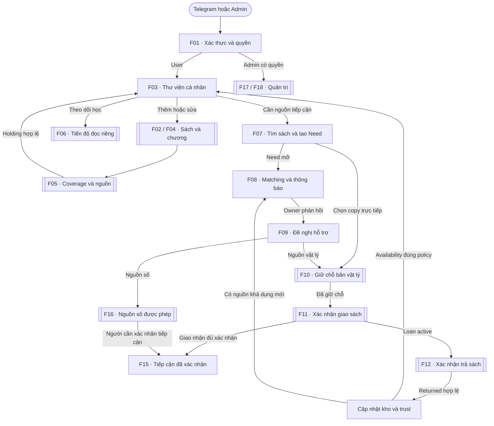

Thiết kế to-be từ ba prompt. F15 kiểm tra mục tiêu Need; không chờ trả sách mới xác nhận đã tiếp cận. F06 không thay đổi Loan/Need. Quản trị tác động theo RBAC và được triển khai chi tiết ở F17–F28.


## F01 — Đăng ký, xác thực và phân quyền

Nhóm: Tổng quan.

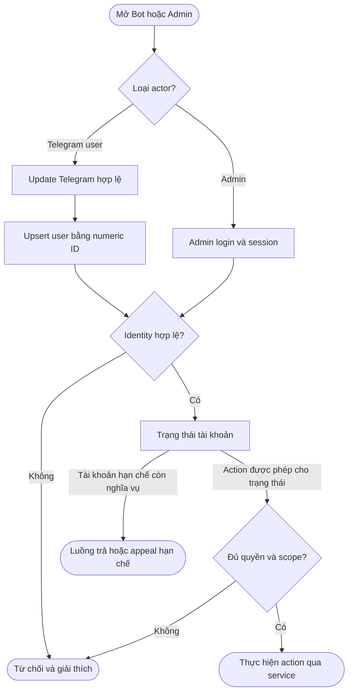

Gateway xác định actor từ update hợp lệ; public request không lấy Telegram ID làm auth. Username không cấp admin. Actor hạn chế có đường trả sách/appeal theo policy; không mặc nhiên được tạo giao dịch mới.


## F02 — Thêm sách, phân biệt edition và copy

Nhóm: Sách và thư viện.

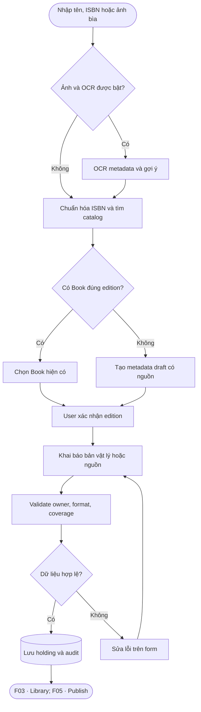

Book đã là edition. Mỗi copy có mã riêng. OCR chỉ gợi ý; không tự xác minh edition hoặc rights. Draft catalog được hiển thị đúng verification scope.


## F03 — Thư viện cá nhân và thư viện cộng đồng

Nhóm: Sách và thư viện.

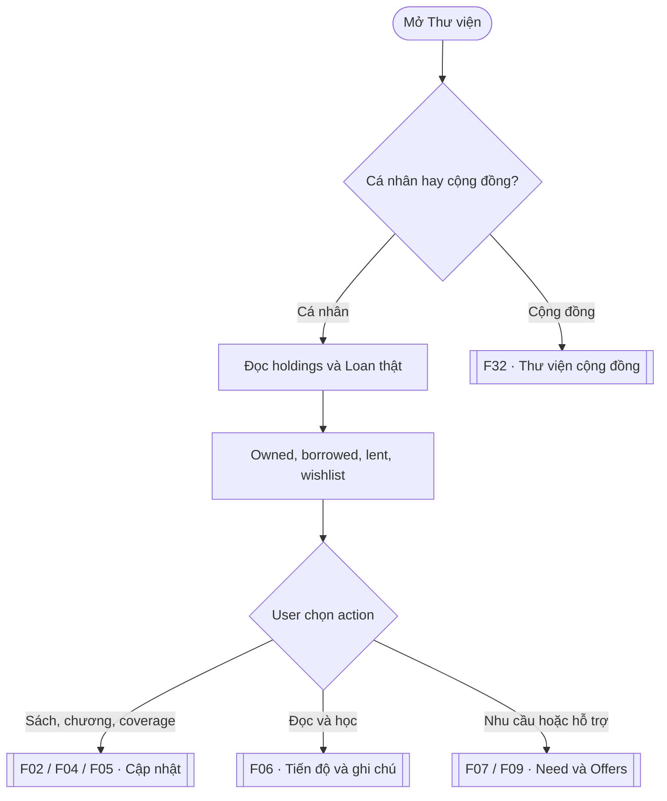

Reading state tách circulation state. Catalog cộng đồng không lộ private inventory, GPS, notes hoặc Telegram ID. Mượn copy trực tiếp không fanout đến toàn cộng đồng.


## F04 — User đề xuất và admin duyệt chương

Nhóm: Sách và thư viện.

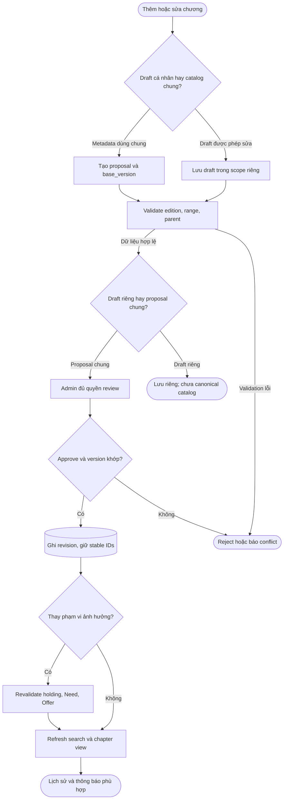

Draft cá nhân chưa trở thành canonical catalog nếu chưa qua publication/review cần thiết. Đổi tên/reorder không đổi ID. Sửa ranges giữ snapshot yêu cầu cũ và đánh dấu cần revalidation.


## F05 — Khai báo coverage, file theo chương và publication

Nhóm: Sách và thư viện.

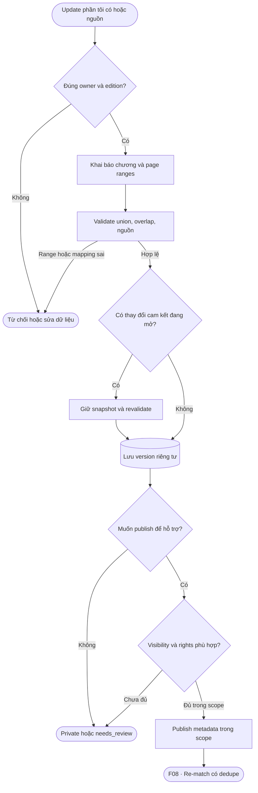

File upload vào quarantine/private; không public khi Save. Right cho metadata, link và file tách nhau. Union không cộng trùng; chưa có denominator thì không tạo percentage. Nguồn chưa duyệt không dùng để thu các phần kế tiếp nhằm tái tạo sách.


## F06 — Tiến độ học, bookmark và ghi chú riêng

Nhóm: Sách và thư viện.

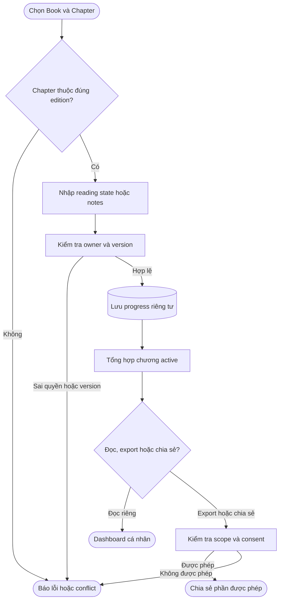

Không có edge từ progress tới Loan returned, Need fulfilled, availability hoặc trust. Không đếm parent và children vào cùng mẫu số. Chapter mới đổi denominator có giải thích; progress cũ được giữ.


## F07 — Tìm sách và tạo Need theo sách hoặc chương

Nhóm: Nhu cầu và matching.

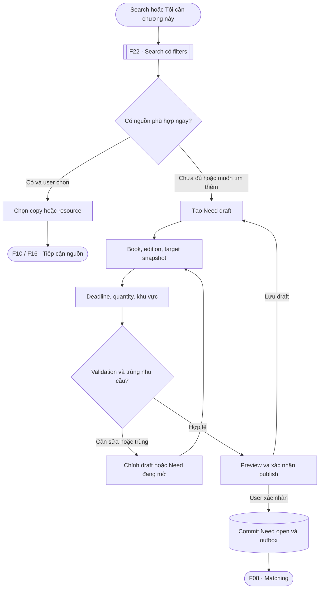

Targets lưu stable IDs và snapshot của đúng edition. Chapters đã đọc không tự hủy Need. Một batch nhiều sách có nhu cầu riêng cho từng title; không fanout trước publish.


## F08 — Eligibility, mọi owner phù hợp và thông báo

Nhóm: Nhu cầu và matching.

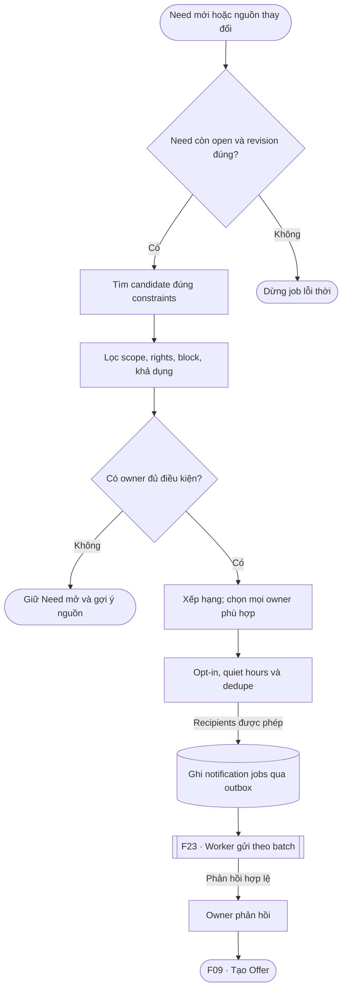

Eligibility là hard gate trước ranking. Một owner có nhiều copies nhận tối đa một thông báo/Need revision; tổ chức có recipients chỉ định. Không silently cắt recipients vì hết batch đầu. Không phản hồi thì vẫn chờ tới deadline hoặc action khác.


## F09 — Owner hỗ trợ, requester chọn Offer

Nhóm: Nhu cầu và matching.

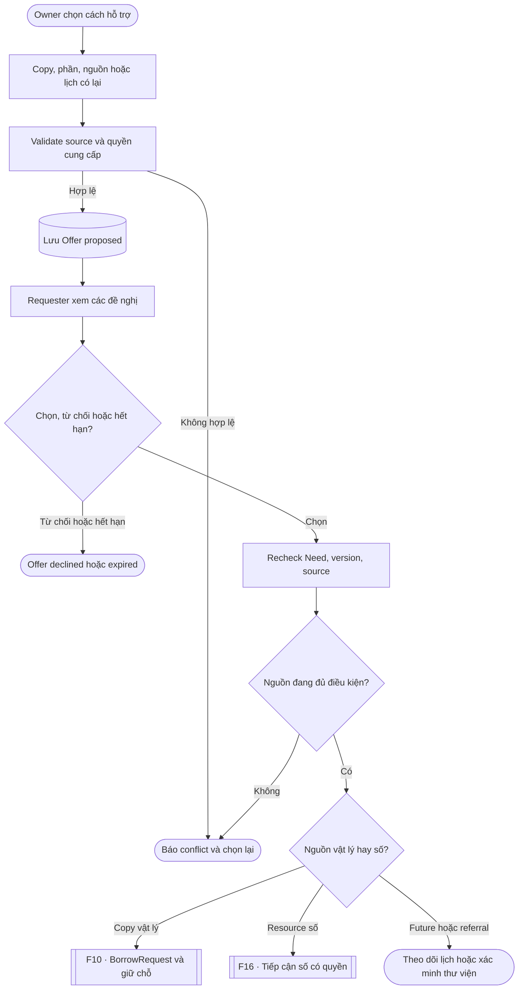

Owner rút offer trước nghĩa vụ thì withdrawn và re-match. selected chưa là fulfilled. Future availability/library referral chưa chứng minh đã có access; phải xác minh nguồn thực tế trước F15.


## F10 — BorrowRequest, chấp nhận và giữ chỗ atomic

Nhóm: Mượn và trả.

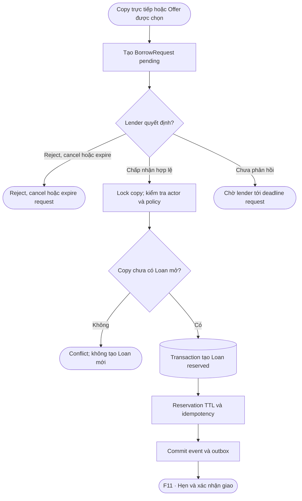

Nếu Offer selected đã kèm acceptance còn hiệu lực của lender, service có thể sử dụng acceptance đó; không bỏ kiểm tra hoặc giả định chọn = nhận sách. Partial unique index/constraint giữ tối đa một Loan mở/copy. Request cạnh tranh nhận conflict/waitlist.


## F11 — Hẹn giao, hai bên xác nhận và bắt đầu Loan

Nhóm: Mượn và trả.

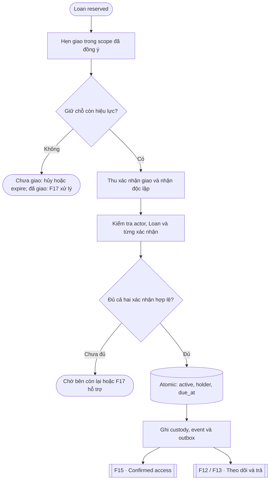

Hai confirmations có thể tới theo thứ tự bất kỳ. Service thu confirmations và chuyển active một lần. Thiếu xác nhận thì tiếp tục chờ; confirmation mới chạy lại kiểm tra. Handover đang có mâu thuẫn không được auto-expire giải phóng copy như chưa giao.


## F12 — Đề nghị trả, xác nhận và mở khả dụng

Nhóm: Mượn và trả.

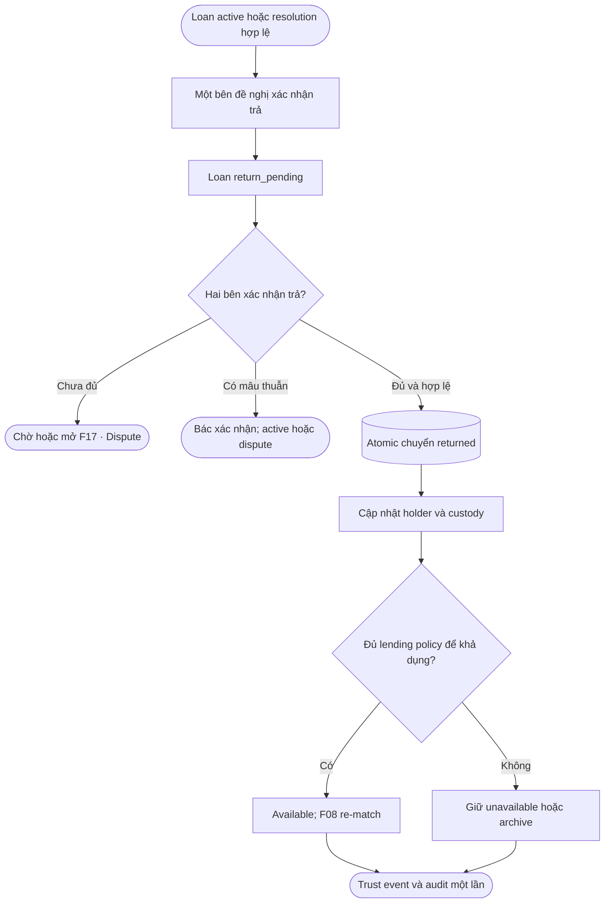

return_pending chưa mở copy cho Loan khác. Không dùng đọc xong thay xác nhận trả. Dispute resolution có permission/reason/evidence có thể hoàn tất trả theo chính sách; lost không đưa copy về available.


## F13 — Nhắc hạn, quá hạn và gia hạn

Nhóm: Mượn và trả.

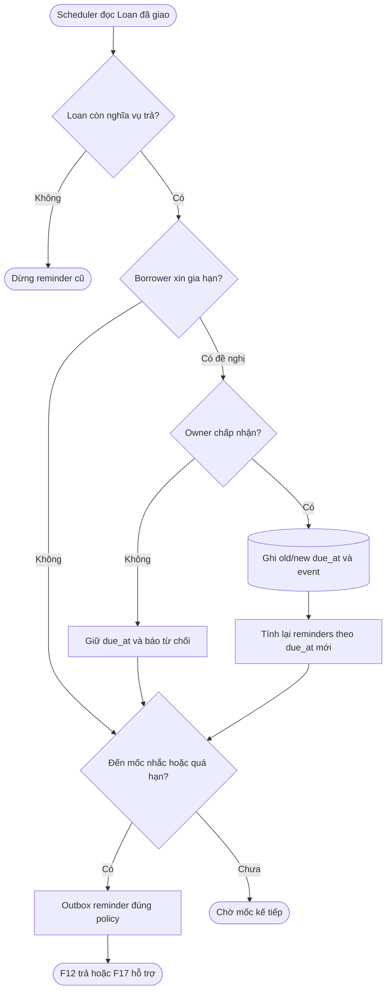

overdue là điều kiện suy ra, không thay state active/return_pending/disputed. Không kết luận lỗi từ dispute chưa xử lý. Gia hạn không xóa lịch sử quá hạn; quiet hours/dedupe trong F23.


## F14 — Cho mượn dây chuyền có owner consent

Nhóm: Mượn và trả.

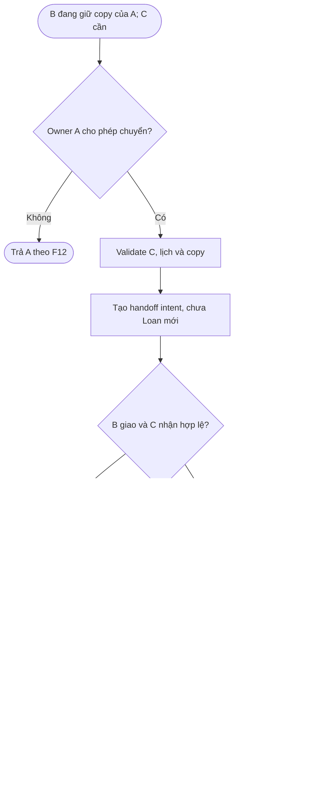

Feature P1. Không tạo reserved Loan thứ hai khi Loan của B còn mở. Handoff chỉ tạo intent; atomic exchange ở bước đủ confirmations. Policy kết thúc nghĩa vụ B phải có event riêng, không ghi là đã trả tận tay A nếu không diễn ra.


## F15 — Logic đáp ứng Need và phần còn thiếu

Nhóm: Nhu cầu và matching.

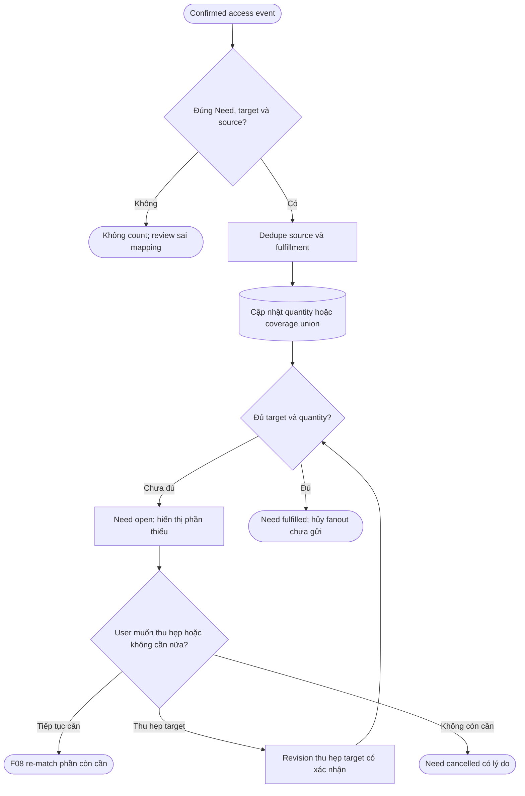

Không dùng sent notification, selected Offer hoặc reading completed làm access. Nhu cầu một chương có thể được đáp ứng bằng full physical copy đã giao. Need fulfilled không kết thúc Loan; nghĩa vụ trả vẫn chạy F12/F13.


## F16 — Nguồn số, quyền và tổng hợp được phép

Nhóm: Tài nguyên và cộng đồng.

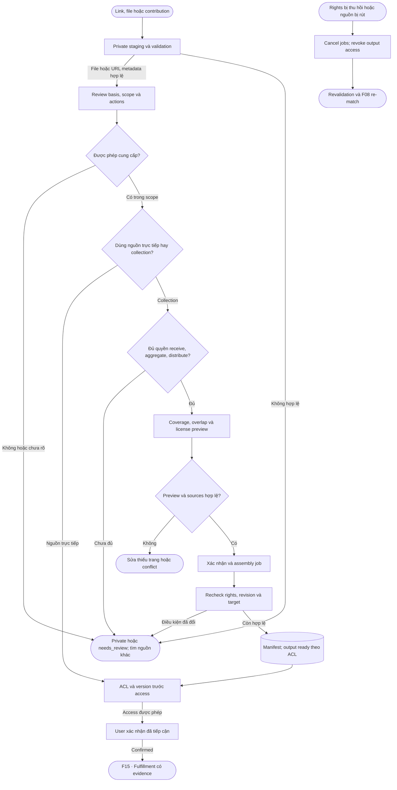

Có 10% hoặc đủ 100% coverage không bỏ qua rights gates. Tổng hợp chỉ khi từng source và output có quyền thích hợp. Delivered file/link chưa là confirmed access. Không cam kết thu hồi bản đã tải ra ngoài hệ thống.


## F17 — Báo cáo, cảnh báo, tranh chấp và appeal

Nhóm: Quản trị và dữ liệu.

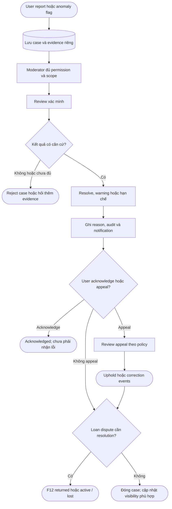

Report chưa xử lý không tự ban/trừ trust. Lost đóng nghĩa vụ theo resolution nhưng không trả copy về available. Chapter report có thể chuyển F04. Rights concern chuyển F16. Block ngăn giao dịch mới nhưng vẫn có kênh trả/appeal.


## F18 — Admin, RBAC và quản trị dữ liệu

Nhóm: Quản trị và dữ liệu.

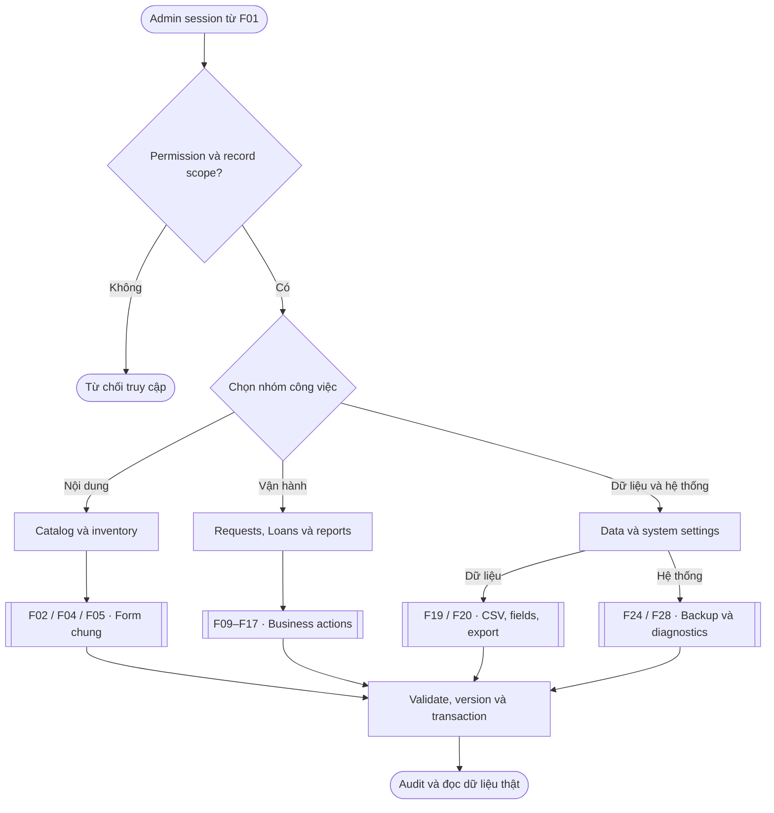

Subflows chịu trách nhiệm transaction riêng; bước chung nhấn mạnh cùng guards/audit, không wrap mọi job trong một transaction lớn. Role grant, SQL console, PII export và restore là permissions đặc biệt; SQL console tắt ở MVP.


## F19 — Custom fields và import CSV có preview

Nhóm: Quản trị và dữ liệu.

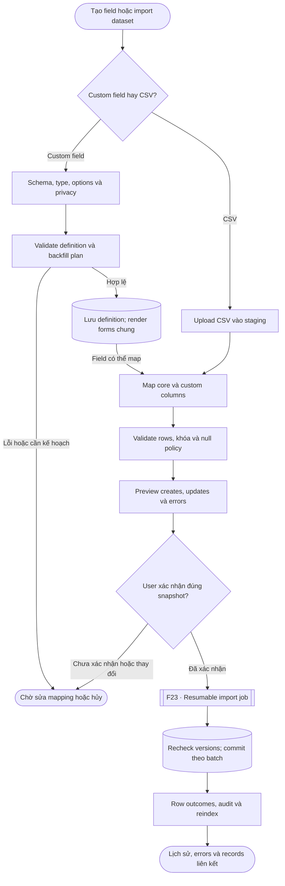

Definition dùng chung Bot/API/Admin/CSV. Preview không ghi production records. Upsert keys không chỉ là title. Dòng lỗi không import; partial success và warnings có outcome rõ. Retry theo job/row không tạo duplicate hoặc tự verified rights.


## F20 — Saved views, bulk edit và export

Nhóm: Quản trị và dữ liệu.

```mermaid
flowchart TD
  a(["Chọn bảng hoặc saved view"])
  b["Recheck permission và scope"]
  c["Filter, columns, sort và selection"]
  d{"Chọn thao tác?"}
  e(["Lưu view; không lưu quyền bypass"])
  f["Preview bulk changes và versions"]
  g["Confirm và validate từng record"]
  h(["Commit batches; audit và errors"])
  i["Snapshot dataset; lọc private fields"]
  j[["F23 · Export job CSV hoặc JSON"]]
  k["Safe CSV và history"]
  l(["Download qua ACL hiện tại"])
  a --> b
  b -->|Được phép| c
  c --> d
  d -->|Save view| e
  d -->|Bulk edit| f
  f --> g
  g -->|Hợp lệ và xác nhận| h
  g -->|Conflict hoặc cần sửa| f
  d -->|Export| i
  i --> j
  j --> k
  k --> l
```

Không bulk edit Loan.status qua dropdown. Selection phân biệt hàng đã chọn với toàn bộ filtered dataset. PII export cần quyền riêng; dữ liệu công thức trong CSV được xử lý phù hợp. Download kiểm tra lại quyền, không dùng public storage URL.


## F21 — Tổ chức, thiếu sách, mượn và tặng

Nhóm: Tài nguyên và cộng đồng.

```mermaid
flowchart TD
  a(["Library hoặc School được xác minh"])
  b["Manager đúng membership scope"]
  c["Khai báo kho hoặc shortage"]
  d["Đúng edition, quantity và deadline"]
  e["Pledge hoặc đề nghị hỗ trợ"]
  f{"Mượn hay tặng?"}
  g[["F10 / F11 · Loan tổ chức"]]
  h["Hẹn và xác nhận donation receipt"]
  i[("Ownership transfer có consent")]
  j["Confirmed received quantity"]
  k{"Đủ nhu cầu tổ chức?"}
  l(["Còn thiếu; tiếp tục matching"])
  m(["Shortage fulfilled"])
  a --> b
  b --> c
  c --> d
  d --> e
  e --> f
  f -->|Mượn| g
  f -->|Tặng| h
  g -->|Confirmed handover| j
  h -->|Hai bên xác nhận| i
  i --> j
  j --> k
  k -->|Chưa đủ| l
  k -->|Đủ| m
```

Pledge chưa phải receipt. Donation không tạo nghĩa vụ Loan giả. User đại diện tổ chức phải được ủy quyền. Library directory ghi thời điểm/source tồn kho, không bịa realtime availability. Không công khai danh sách học sinh nhận sách.


## F22 — Search, fuzzy, semantic và fallback AI

Nhóm: Nhu cầu và matching.

```mermaid
flowchart TD
  a(["Query, ISBN hoặc chapter target"])
  b["Normalize và parse constraints"]
  c{"AI parser được bật và hợp lệ?"}
  d["Typed intent; schema validation"]
  e["Keyword và ISBN fallback"]
  f["FTS, fuzzy và catalog retrieval"]
  g{"Semantic được bật và khả dụng?"}
  h["Authorized metadata embeddings"]
  i["Fuse hoặc rerank candidates"]
  j["Hard edition, rights và scope filters"]
  k{"Có kết quả đủ điều kiện?"}
  l(["Nguồn có giải thích; F07 / F10"])
  m(["No-result; Need hoặc thư viện"])
  a --> b
  b --> c
  c -->|Có| d
  c -->|Không hoặc timeout| e
  d -->|Typed output hợp lệ| f
  d -->|Invalid output| e
  e --> f
  f --> g
  g -->|Có| h
  g -->|Không hoặc lỗi| j
  h --> i
  i --> j
  j --> k
  k -->|Có| l
  k -->|Không| m
```

AI không tạo sách không tồn tại, sửa Loan hoặc approve rights. Canonical/public metadata và permitted fields mới được index; private notes không vào index chung. Hard constraints vẫn quyết định eligibility, không bị score cao vượt qua.


## F23 — Outbox, worker, retry và thông báo bền vững

Nhóm: Hệ thống và logic.

```mermaid
flowchart TD
  a(["Business mutation hợp lệ"])
  b[("Transaction ghi state, event, outbox")]
  c{"Commit thành công?"}
  d(["Rollback; không gửi từ state chưa commit"])
  e["Worker claim job bằng lease"]
  f["Recheck actor, revision và relevance"]
  g{"Job còn được phép thực hiện?"}
  h(["Cancel hoặc skip lỗi thời"])
  i["Thực hiện job với rate limits"]
  j{"Outcome?"}
  k(["Mark success và outcome bền vững"])
  l["Backoff, retry_after và retry limit"]
  m(["Failed hoặc dead-letter; admin review"])
  n(["Crash và lease hết hạn"])
  a --> b
  b --> c
  c -->|Không| d
  c -->|Có| e
  e --> f
  f --> g
  g -->|Không| h
  g -->|Có| i
  i --> j
  j -->|Thành công| k
  j -->|Lỗi tạm thời| l
  j -->|Lỗi vĩnh viễn hoặc hết retries| m
  l -->|Đến lịch retry| e
  n -->|Lease recovery| e
```

Dedupe mutations/internal jobs; Telegram sending là at-least-once với giảm lặp, không hứa exactly-once khi mất response sau send. Quiet hours, opt-in, global/per-user limits và catch-up sau offline nằm ở execution policy. Không giữ DB lock khi gọi mạng.


## F24 — Backup và restore có kiểm soát

Nhóm: Hệ thống và logic.

```mermaid
flowchart TD
  a(["Admin hoặc lịch backup"])
  b{"Create hay restore?"}
  c["Snapshot DB và media nhất quán"]
  d[("Manifest, checksum và lưu private")]
  e(["Backup history và kiểm tra đọc"])
  f["Chọn artifact; quyền restore"]
  g{"Checksum và schema phù hợp?"}
  h(["Dừng; không ghi đè dữ liệu"])
  i["Preview và explicit confirmation"]
  j["Pre-restore backup; maintenance"]
  k["Pause writes và workers"]
  l["Restore DB và media theo manifest"]
  m["Integrity, sessions và health checks"]
  n{"Kiểm tra pass?"}
  o(["Resume; audit và hậu kiểm"])
  p(["Giữ maintenance; phục hồi có kiểm soát"])
  a --> b
  b -->|Create| c
  c --> d
  d --> e
  b -->|Restore| f
  f --> g
  g -->|Không| h
  g -->|Có| i
  i -->|Không xác nhận| h
  i -->|Xác nhận| j
  j --> k
  k --> l
  l --> m
  m --> n
  n -->|Có| o
  n -->|Không| p
```

Restore rehearsal chạy trên môi trường riêng. Không chọn latest rồi ghi đè im lặng. Database-only backup không đủ cho media. Session/job policy sau restore phải tránh replay side effects đã gửi ra ngoài.


## F25 — QR lookup và xác nhận giao nhận

Nhóm: Tài nguyên và cộng đồng.

```mermaid
flowchart TD
  a(["Scan QR trên BookCopy"])
  b["Lookup public_code ngẫu nhiên"]
  c{"Copy tồn tại và được hiển thị?"}
  d(["Không tiết lộ record riêng"])
  e["Metadata và availability đã lọc"]
  f{"Xem hay thực hiện giao dịch?"}
  g(["Kết thúc lookup"])
  h[["F01 · Actor xác thực và guards"]]
  i{"Mượn hay xác nhận handover?"}
  j[["F10 · Request copy"]]
  k["Token riêng, scope và hạn dùng"]
  l(["F11 / F12 · Confirmation hợp lệ"])
  a --> b
  b --> c
  c -->|Không| d
  c -->|Có| e
  e --> f
  f -->|Chỉ xem| g
  f -->|Giao dịch| h
  h --> i
  i -->|Mượn| j
  i -->|Handover hoặc trả| k
  k -->|Token và actor hợp lệ| l
  k -->|Không hợp lệ| d
```

QR in trên sách không phải secret và không cấp quyền mutation. Nếu có handover token thì là token khác, có hạn dùng/one-time/scope. Biết copy ID không thay authorization.


## F26 — Logic dữ liệu và nguồn sự thật

Nhóm: Hệ thống và logic.

```mermaid
flowchart TD
  a["Book là một edition"]
  b["Chapter canonical và revision"]
  c["BookCopy vật lý"]
  d["Party: owner và current holder"]
  e["Resource và rights/version"]
  f["Holding coverage"]
  g["Need target và snapshot"]
  h["Offer source"]
  i["BorrowRequest và Loan"]
  j["Confirmed access và fulfillment"]
  k["Progress riêng của user"]
  l["Library view từ dữ liệu gốc"]
  a -->|Cấu trúc chương| b
  a -->|Nhiều copies| c
  a -->|Nguồn theo edition| e
  d -->|Owner khác holder| c
  b -->|ID hoặc ranges| f
  c -->|Phần vật lý có| f
  e -->|Phần nguồn số có| f
  b -->|Targets ổn định| g
  g -->|Nhu cầu và đề nghị| h
  c -->|Nguồn vật lý| h
  e -->|Nguồn số| h
  h -->|Vật lý: chọn và giữ chỗ| i
  i -->|Confirmed handover| j
  e -->|Authorized access confirmed| j
  j -->|Tính mức đáp ứng| g
  b -->|Tiến độ cá nhân| k
  c -->|Ownership và kho| l
  i -->|Circulation và due_at| l
  k -->|Reading state riêng| l
```

Sơ đồ quan hệ nghiệp vụ, không phải schema DDL đã kiểm chứng. Progress không là nguồn của availability/fulfillment. Library là read view, không copy một bảng trạng thái mượn độc lập. Resource không biến thành BookCopy.


## F27 — Logic trạng thái Loan

Nhóm: Hệ thống và logic.

```mermaid
flowchart TD
  a(["BorrowRequest accepted"])
  b["reserved"]
  c["active"]
  d["return_pending"]
  e["disputed"]
  f(["returned"])
  g(["closed_lost"])
  h(["cancelled hoặc expired"])
  a -->|Reservation atomic| b
  b -->|Hai bên xác nhận giao| c
  b -->|Chưa giao; hủy hoặc hết TTL| h
  c -->|Đề nghị xác nhận trả| d
  d -->|Bác xác nhận; chưa thành dispute| c
  c -->|Mở tranh chấp| e
  d -->|Mở tranh chấp| e
  d -->|Hai bên xác nhận trả| f
  e -->|Resolution tiếp tục mượn| c
  e -->|Resolution xác nhận đã trả| f
  e -->|Resolution xác nhận mất| g
```

overdue là thuộc tính suy ra cho nghĩa vụ trả còn mở sau due_at, không là node status riêng. Một copy tối đa một Loan trong reserved/active/return_pending/disputed. Reading completed, Need fulfilled hoặc sent message không tạo transition Loan.


## F28 — Kiểm tra quy trình, lỗi nối và nghiệm thu

Nhóm: Hệ thống và logic.

```mermaid
flowchart TD
  a(["Repository và baseline prompts"])
  b["Inventory routes, services và jobs"]
  c["As-is có evidence; to-be mong muốn"]
  d["Transition và connection matrix"]
  e["So khớp guards, IDs, events, UI"]
  f{"Có lệch logic hoặc dead-end?"}
  g["Reproduce, severity và root cause"]
  h["Fix services, contracts và migrations"]
  i["Integration, concurrency, privacy tests"]
  j{"Các checks trong scope pass?"}
  k(["Báo FAIL, BLOCKED hoặc NOT_RUN thật"])
  l(["Handover evidence và limitations"])
  a --> b
  b --> c
  c --> d
  d --> e
  e --> f
  f -->|Có| g
  f -->|Chưa thấy lỗi| i
  g --> h
  h --> i
  i --> j
  j -->|Fail có thể tái hiện và sửa| g
  j -->|Thiếu điều kiện kiểm tra| k
  j -->|Pass có evidence| l
```

Bộ flowchart này chỉ mô tả to-be. Không có repository ứng dụng nên không gán các quy trình PASS runtime. Diagram/code/test đều cần traceability. Không sửa docs để che logic sai hoặc reset dữ liệu để test dễ pass.


## F29 — Feature flags, health và truy vấn diagnostics

Nhóm: Hệ thống và logic.

```mermaid
flowchart TD
  a(["Admin mở health hoặc settings"])
  b{"Role và setting schema hợp lệ?"}
  c(["Từ chối hoặc sửa validation"])
  d{"Enable feature hay xem health?"}
  e{"Implementation và dependencies đủ?"}
  f(["Disabled hoặc BLOCKED có lý do"])
  g[("Lưu flag version và audit")]
  h["Live: process; ready: essentials"]
  i["Worker heartbeat, queue và storage"]
  j["AI/OCR status riêng"]
  k["Healthy, degraded, disabled hoặc unknown"]
  l(["Alert qua F23; audit qua F28"])
  a --> b
  b -->|Không| c
  b -->|Có| d
  d -->|Enable feature| e
  e -->|Không| f
  e -->|Có| g
  d -->|Health| h
  g --> h
  h --> i
  i --> j
  j --> k
  k --> l
```

Disabled AI không được hiển thị như đã kết nối thành công. Logs/diagnostics lọc secrets/PII. Flag enable không thay rights/RBAC. Search reindex và AI embedding rebuild dùng F23, không chạy block request.


## F30 — Kiến trúc ứng dụng và đường đi dữ liệu

Nhóm: Tổng quan.

```mermaid
flowchart TD
  a(["Telegram updates qua polling"])
  b["aiogram Bot gateway"]
  c["Internal API với delegated actor"]
  d(["Admin session và CSRF"])
  e["Admin routes và forms"]
  f[["F01 / F31 · Guards và mutation"]]
  g["Application services dùng chung"]
  h[("Repository và PostgreSQL")]
  i[("Outbox và durable jobs")]
  j[["F23 · Worker và scheduler"]]
  k["Telegram notification transport"]
  l["OCR / AI adapters có fallback"]
  m[("Private media và backup storage")]
  n(["Public discovery DTO được lọc"])
  a --> b
  b --> c
  c --> f
  d --> e
  e --> f
  f --> g
  n -->|Read permissions và public scope| g
  g -->|Transactions hoặc reads| h
  h -->|Event cùng commit| i
  i --> j
  j -->|Notification jobs| k
  j -->|Optional AI/OCR jobs| l
  g -->|Media qua ACL service| m
  j -->|Import, export, backup outputs| m
  l -->|Typed kết quả được validate| g
```

Một codebase modular monolith: Bot và Admin dùng chung nghiệp vụ. Admin có thể cùng FastAPI process. PostgreSQL và storage private; web mặc định loopback trên PC. Polling không dùng đồng thời webhook, một polling process/token. AI không trực tiếp sửa DB hoặc cấp quyền.


## F31 — Logic chung cho mutation và chống thao tác trùng

Nhóm: Hệ thống và logic.

```mermaid
flowchart TD
  a(["Mutation từ Bot, API hoặc Admin"])
  b["Actor, permission và record scope"]
  c{"Idempotency record đã có?"}
  d{"Payload và action scope khớp?"}
  e(["Trả outcome cũ theo quyền hiện tại"])
  f(["Conflict hoặc từ chối"])
  g["Validate schema, state, rights, version"]
  h{"Guards còn hợp lệ?"}
  i["Transaction lock và recheck"]
  j[("Atomic state, history và outbox")]
  k["Commit cùng idempotency outcome"]
  l(["Trả kết quả; UI đọc state chuẩn"])
  m[["F23 · Side effects sau commit"]]
  a --> b
  b -->|Không đủ quyền| f
  b -->|Được phép| c
  c -->|Có| d
  d -->|Khớp| e
  d -->|Không khớp| f
  c -->|Chưa có| g
  g --> h
  h -->|Không| f
  h -->|Có| i
  i -->|Race hoặc guard thay đổi| f
  i -->|Vẫn hợp lệ| j
  j --> k
  k --> l
  k --> m
```

Unique constraints ở DB bảo vệ cả concurrent retries khi lookup ban đầu chưa có record. Không gửi mạng trong transaction. Retry cùng key/payload không tạo thêm Loan, confirmations, trust, import row hoặc fulfillment; payload khác báo conflict.


## F32 — Khám phá thư viện cộng đồng và nguồn tiếp cận

Nhóm: Sách và thư viện.

```mermaid
flowchart TD
  a(["Mở Thư viện cộng đồng"])
  b["Chỉ holdings được publish trong scope"]
  c["Filter Book, Chapter, edition và khu vực"]
  d{"Nguồn đủ điều kiện hiện tại?"}
  e(["F07 · Need hoặc theo dõi có lại"])
  f{"Chọn loại nguồn"}
  g["Copy vật lý và policy"]
  h["Resource và allowed access"]
  i["Directory tổ chức và inventory source"]
  j[["F10 · BorrowRequest tới copy"]]
  k[["F16 · Access theo rights"]]
  l[["F21 · Liên hệ qua tổ chức có scope"]]
  a --> b
  b --> c
  c --> d
  d -->|Không| e
  d -->|Có| f
  f -->|Copy| g
  f -->|Nguồn số| h
  f -->|Thư viện hoặc trường| i
  g --> j
  h --> k
  i --> l
```

Discovery không công khai Telegram numeric ID, exact home location hoặc private notes. Nguồn tổ chức có inventory_updated_at/verification; directory entry chưa chứng minh có sách để mượn ngay.
