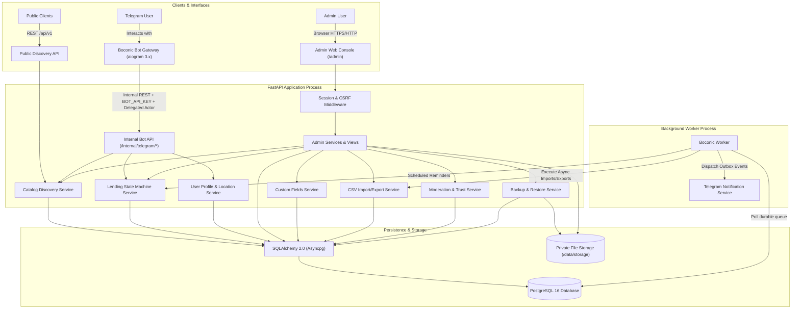

# Boconic — System Architecture & Trust Boundaries

**Version:** 2.0  
**Date:** 01/10/2026

## 1. System Overview

Boconic is designed as a **modular monolith** with clean separation between delivery layers (FastAPI REST API, Jinja2/HTMX Admin Console, aiogram Telegram Gateway) and core application domain services.

## 2. Trust Boundaries & Security Domains

1. **Telegram Gateway Trust Boundary:**
   - The bot gateway runs as an authorized internal client.
   - It authenticates to `/api/v1/internal/*` using a high-entropy `BOT_API_KEY`.
   - The actor identity is passed via header `X-Telegram-User-Id`, which the bot extracts strictly from verified aiogram `Update` objects.
   - The backend validates the `BOT_API_KEY`, resolves the user from the database, and enforces authorization.
   - Public API requests are strictly forbidden from supplying or spoofing `X-Telegram-User-Id`.

2. **Admin Web Console Trust Boundary:**
   - Admin authentication is based on server-side stored sessions referenced by an `HttpOnly`, `SameSite=Lax`, secure cookie (`boconic_session`).
   - Mutations (POST/PUT/DELETE) require valid CSRF tokens verified against the active session.
   - Granular RBAC permissions (`users.read`, `books.write`, `loans.resolve_dispute`, `backups.restore`, etc.) are checked at both router and service levels.
   - Scoped permissions prevent multi-tenant violations (e.g., a Library Manager can only manage resources of their assigned organization).

3. **Privacy & Public Discovery Boundary:**
   - Public DTOs intentionally strip all PII: phone numbers, emails, precise GPS coordinates, internal database IDs, and numeric Telegram IDs.
   - User identity in public catalog views is replaced with randomized obfuscated aliases (e.g., `User #A81F`).
   - Distances are rounded into discrete intervals (e.g., "Khoảng 1–3 km") to prevent trilateration attacks.

4. **Resource Rights & Digital Assets:**
   - Three distinct permission tiers for resources:
     - Tier 1: Metadata display only.
     - Tier 2: External link referral (link verified).
     - Tier 3: Direct file storage & distribution (requires verified open license or explicit copyright permission).
   - Resources have statuses: `pending`, `verified`, `rejected`, `needs_review`. Only verified actions are permitted.
