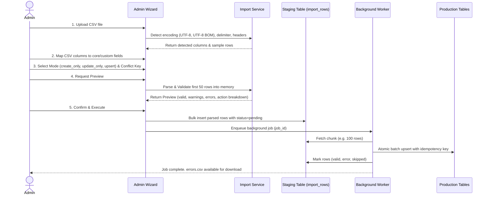

# Boconic — CSV Import & Export Specifications

**Version:** 2.0  
**Date:** 01/10/2026

## 1. Import Architecture

The CSV Import engine is built for durability, chunked streaming, and exact error reporting.

## 2. Invariants & Formats
1. **Encoding & Format Support:**
   - UTF-8 and UTF-8 with BOM (`\xef\xbb\xbf`).
   - Delimiters: Comma (`,`), Semicolon (`;`), Tab (`\t`).
   - Handles multi-line text enclosed in RFC-4180 quotes.
2. **Conflict & Null Policy:**
   - `create_only`: If conflict key exists, row marked as `skipped` (with warning) or `error`.
   - `update_only`: If conflict key not found, row marked as `error`.
   - `upsert`: If conflict key exists, update record; otherwise create new. Empty cells do not overwrite existing non-null data unless explicitly specified.
3. **Partial Failure & Isolation:**
   - Valid rows in committed batches are preserved.
   - Failed rows are logged with line number, column name, error code, and error message into `errors.csv`.
4. **Export Safety:**
   - Export queries respect caller RBAC permissions. Users without `exports.pii` will have email, phone numbers, exact coordinates, and sensitive custom fields redacted.
   - Spreadsheet Formula Injection prevention: prepends a tab (`\t`) or quote if cell string starts with `=`, `+`, `-`, or `@`.
