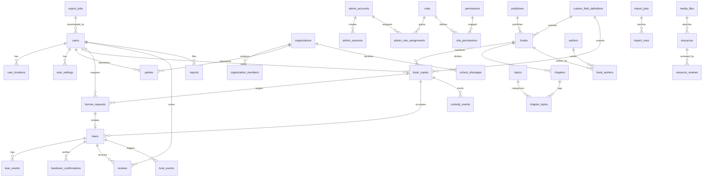

# Boconic — Entity Relationship Diagram & Invariants

**Version:** 2.0  
**Date:** 01/10/2026

## 1. Complete Database ERD



## 2. Core Invariants & Database Constraints

1. **Loan Concurrency & Mutual Exclusion:**
   - A single physical `BookCopy` can have at most **one** ongoing/uncompleted `Loan` (states: `reserved`, `active`, `return_pending`, `disputed`).
   - Enforced by PostgreSQL partial unique index:
     ```sql
     CREATE UNIQUE INDEX uq_active_loan_per_copy 
     ON loans (copy_id) 
     WHERE status IN ('reserved', 'active', 'return_pending', 'disputed');
     ```
2. **Borrower/Owner Separation:**
   - A user cannot borrow their own `BookCopy`.
   - Enforced via check constraint & service validation:
     ```sql
     CHECK (borrower_id != owner_id)
     ```
3. **Request Duplication Prevention:**
   - A borrower cannot have multiple concurrent `pending` borrow requests for the same `BookCopy`.
     ```sql
     CREATE UNIQUE INDEX uq_pending_request_per_user_copy 
     ON borrow_requests (borrower_id, copy_id) 
     WHERE status = 'pending';
     ```
4. **Referential Integrity for Parties:**
   - `parties` points to either a `user_id` OR an `organization_id` using a strict XOR check constraint:
     ```sql
     CHECK ((user_id IS NOT NULL AND organization_id IS NULL) OR 
            (user_id IS NULL AND organization_id IS NOT NULL));
     ```
5. **Chapter Page Boundaries:**
   - `page_start <= page_end` and `page_start >= 1`.
6. **ISBN Canonical Normalization:**
   - `isbn13` is unique when present, normalized, and validated with standard modulo-10 checksum algorithm.
7. **Append-Only History:**
   - `loan_events`, `custody_events`, and `audit_logs` are strictly append-only. Modification or deletion of past events is forbidden.
