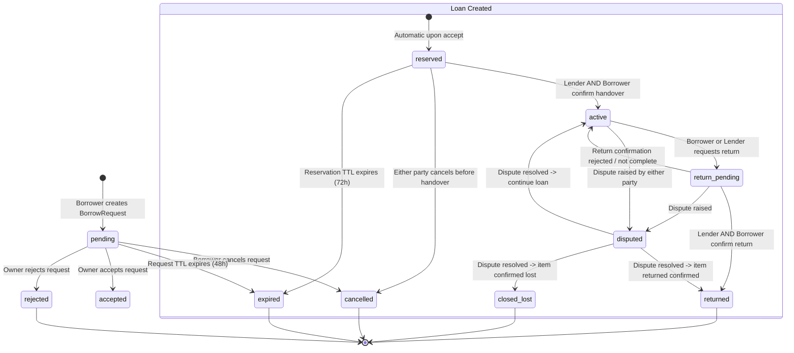

# Boconic — Lending State Machine & Handshake Protocol

**Version:** 2.0  
**Date:** 01/10/2026

## 1. State Diagram

## 2. Transition Table & Authorization Matrix

| Initial State | Action | Permitted Actor | Target State | Preconditions | Side Effects |
| :--- | :--- | :--- | :--- | :--- | :--- |
| `none` | `create_request` | Verified Borrower | `pending` (Request) | Copy status is `available`, user not blocked by owner, borrower != owner | Emits `REQUEST_CREATED` outbox event to notify owner. |
| `pending` | `accept_request` | Copy Owner / Custodian | `reserved` (Loan) | Copy still available, no conflicting reserved loan | Atomically sets other pending requests to `waitlisted` or cancels; creates Loan; sets `reservation_expires_at` (default 72h); updates Copy to `reserved`. |
| `pending` | `reject_request` | Copy Owner / Custodian | `rejected` (Request)| Request is pending | Emits `REQUEST_REJECTED` event. |
| `pending` | `cancel_request` | Borrower | `cancelled` (Request)| Request is pending | Frees slot. |
| `reserved` | `confirm_handover` | Lender / Borrower | `reserved` / `active` | Loan is reserved, within TTL | Handshake record created. When both parties confirmed: state -> `active`, sets `handed_over_at = now()`, `due_at = now() + duration_days`, updates `current_holder_id = borrower_id`, writes `custody_events`. |
| `reserved` | `cancel_reservation`| Either party | `cancelled` (Loan) | Not yet handed over | Reverts Copy status to `available`. |
| `active` | `request_return` | Borrower / Lender | `return_pending` | Loan is active | Sets return proposed date/meeting location. Emits `RETURN_REQUESTED` event. Copy remains unavailable. |
| `return_pending` | `confirm_return` | Lender / Borrower | `return_pending` / `returned` | Loan is return_pending | When both parties confirmed: state -> `returned`, sets `returned_at = now()`, updates `current_holder_id = owner_id`, marks Copy `available`, emits `LOAN_RETURNED` trust event. |
| `active` / `return_pending` | `raise_dispute` | Either party | `disputed` | Loan is active or return_pending | Locks status, notifies admin moderation queue. |
| `disputed` | `resolve_dispute` | Admin / Moderator | `active` / `returned` / `closed_lost` | Admin permission required | Mandatory reason logged in audit log; updates copy circulation status accordingly. |

## 3. Overdue Specification
- `overdue` is **not** a separate mutually exclusive state; it is a **derived condition**:
  $$\text{IsOverdue} \iff \text{status} = \text{active} \land \text{due\_at} < \text{CurrentUTC}()$$
- This prevents race conditions where a dispute or return confirmation could conflict with an automated overdue cron status flip.
- Background worker calculates overdue loans dynamically and queues reminder notifications at calibrated intervals (e.g. 24 hours before due, at due date, and 3 days post due).
