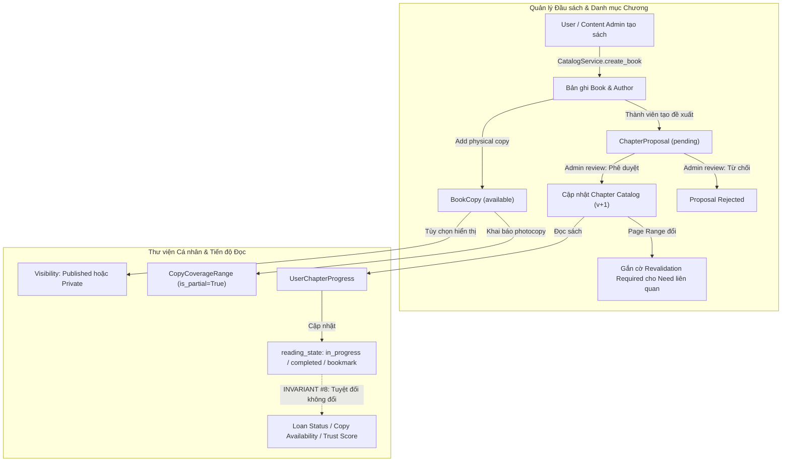
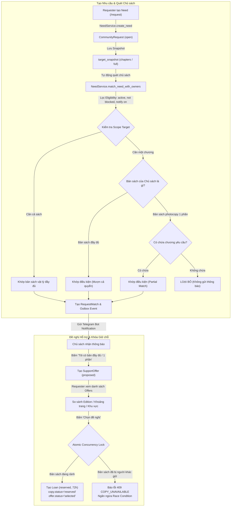
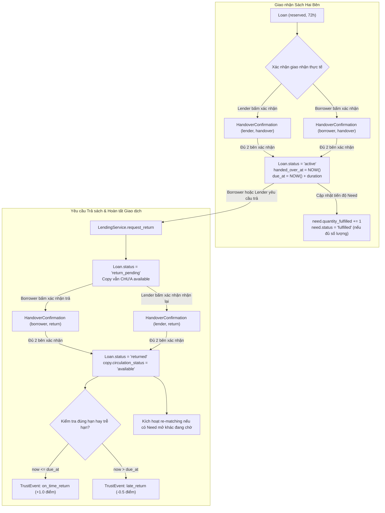
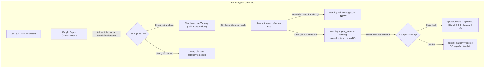

# BOCONIC — SƠ ĐỒ QUY TRÌNH HIỆN TẠI (PROCESS MAP AS-IS)

> **Boconic Platform** — *"Find what you need. Find who can help."*  
> Sơ đồ kiến trúc luồng dữ liệu và trạng thái hoạt động thực tế trên repository hiện có (sử dụng Mermaid Top-Down).

---

## 1. Sơ đồ 1: Luồng Quản lý Catalog, Chương và Thư viện Cá nhân

---

## 2. Sơ đồ 2: Luồng Nhu cầu Sách, Matching, Đề nghị Hỗ trợ và Giữ chỗ

---

## 3. Sơ đồ 3: Luồng Giao nhận, Trả sách, Uy tín và Hoàn tất

---

## 4. Sơ đồ 4: Báo cáo, Kiểm duyệt, Cảnh báo và Khiếu nại

