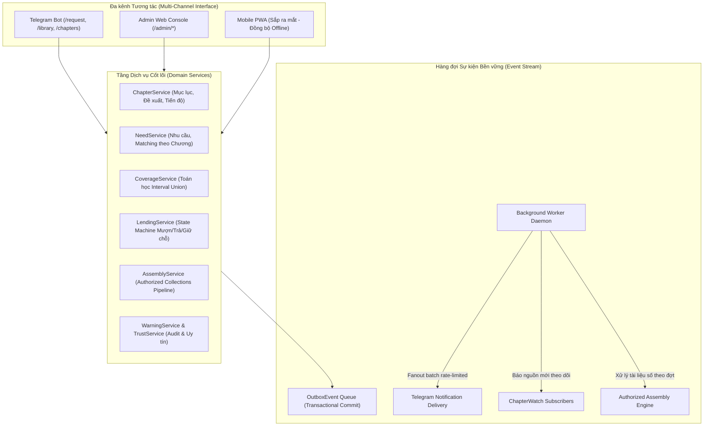
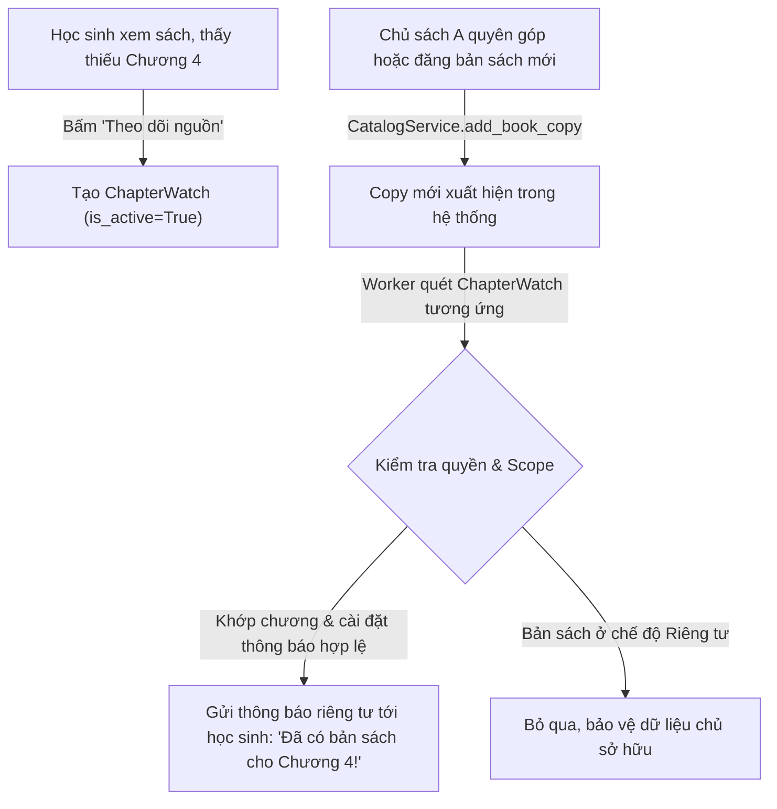
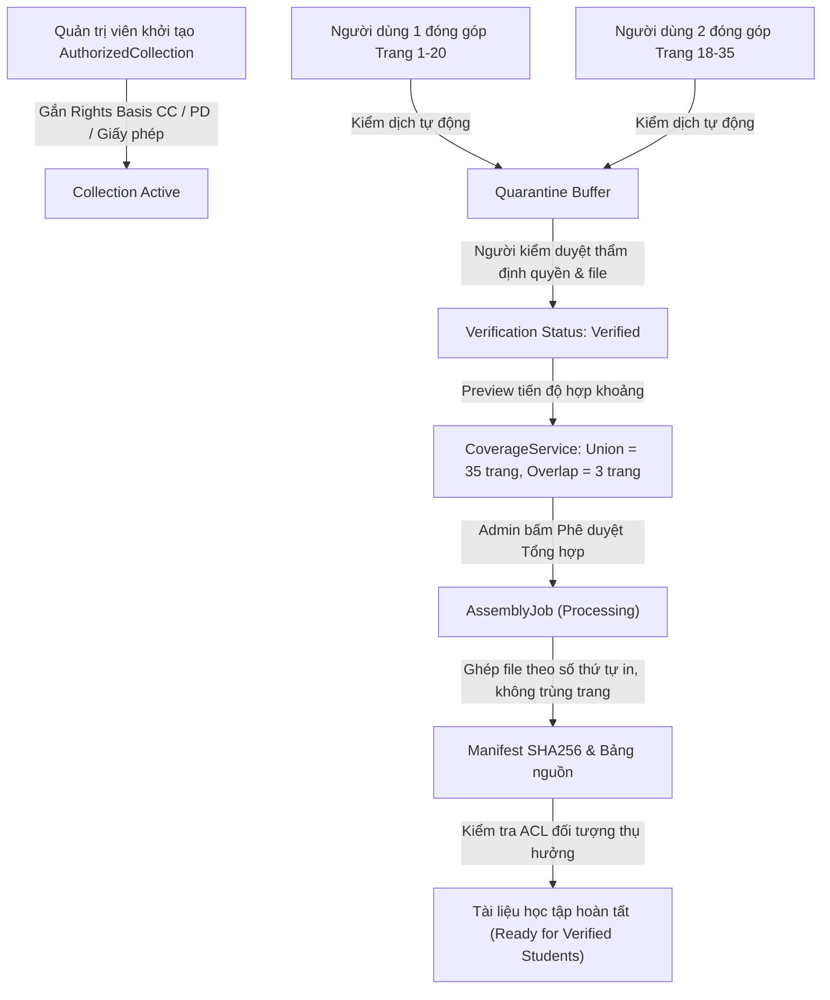

# BOCONIC — SƠ ĐỒ QUY TRÌNH MỤC TIÊU (PROCESS MAP TO-BE)

> **Boconic Platform** — *"Find what you need. Find who can help."*  
> Sơ đồ kiến trúc mục tiêu mở rộng tích hợp học liệu theo chương, mạng lưới trường học và quy trình tự động hóa có kiểm soát.

---

## 1. Sơ đồ Mục tiêu Tổng thể (Target Architecture To-Be)

---

## 2. Sơ đồ Luồng Đăng ký & Theo dõi Nguồn mới cho Chương (`ChapterWatch`)

---

## 3. Sơ đồ Quy trình Tổng hợp Tài liệu Đóng góp Hợp thức (`Authorized Contribution Pipeline`)

