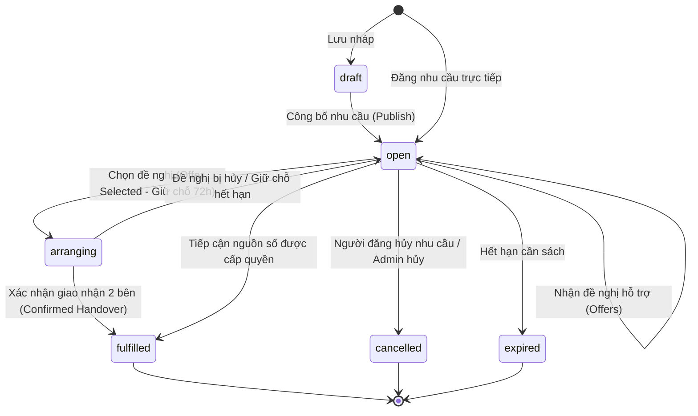
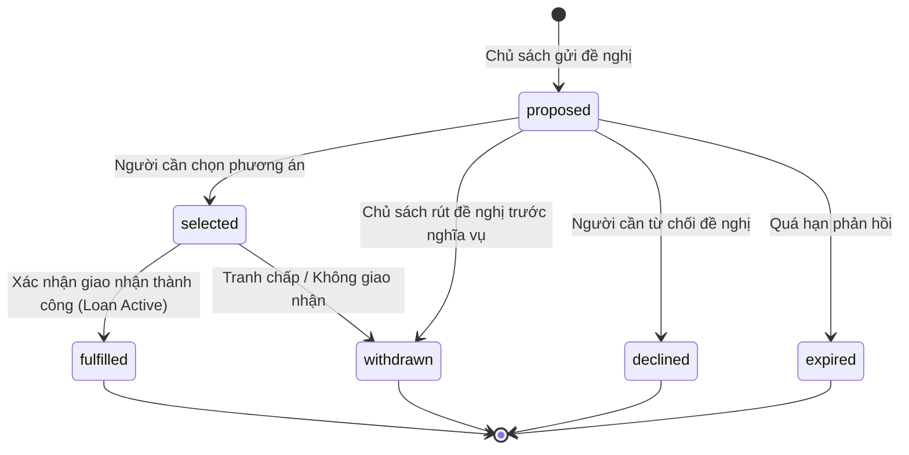

# BOCONIC — REQUEST & OFFER STATE MACHINE SPECIFICATION

**Tagline:** *Find what you need. Find who can help.*  
Tài liệu quy định chi tiết vòng đời trạng thái của Nhu cầu sách (`CommunityRequest`), Đề nghị hỗ trợ (`SupportOffer`), cơ chế khóa loại trừ tương hỗ (Mutual Exclusion Lock), và quy tắc hoàn tất nhu cầu (`Confirmed Handover Fulfillment`).

---

## 1. Trạng thái của Nhu cầu sách (`CommunityRequest` / Need)

Mô hình dữ liệu lưu trữ trường `status` với các trạng thái sau:

### Chi tiết các trạng thái:
- **`draft`:** Nhu cầu được lưu tạm thời, chưa gửi fanout thông báo ra cộng đồng.
- **`open`:** Nhu cầu đang mở tìm kiếm. Các chủ sách đủ điều kiện được đưa vào hàng đợi thông báo.
- **`arranging` (Derived / Sub-state):** Người cần đã chọn một đề nghị (`selected`). Bản sách được giữ chỗ tạm thời (`Loan.status = "reserved"`). Nhu cầu chưa được đánh dấu hoàn tất.
- **`fulfilled`:** Nhu cầu đã được đáp ứng thành công. **Quy tắc bắt buộc:** Chỉ chuyển sang `fulfilled` khi có xác nhận giao nhận thực tế từ cả hai bên (`HandoverConfirmation` cho cả lender và borrower), hoặc khi người học xác nhận đã tiếp cận thành công nguồn số được phép. **Tuyệt đối không tự động chuyển `fulfilled` khi mới chỉ gửi link, gửi file hoặc vừa chọn đề nghị.**
- **`cancelled`:** Người cần chủ động hủy hoặc Quản trị viên can thiệp xử lý vi phạm.
- **`expired`:** Quá thời hạn cần sách mà chưa có người đáp ứng hoặc người cần không gia hạn.

---

## 2. Trạng thái của Đề nghị hỗ trợ (`SupportOffer`)

### Phân loại đề nghị (`offer_type`):
1. `full_physical_copy`: Bản sách vật lý đầy đủ.
2. `partial_physical_copy`: Bản sách vật lý một phần / photocopy bài tập.
3. `authorized_digital_resource`: Tài nguyên số đã được xác minh quyền phân phối.
4. `future_availability`: Sách đang được người khác mượn, hẹn ngày có lại.
5. `library_referral`: Giới thiệu tới nguồn thư viện mở hoặc tổ chức đối tác.

---

## 3. Cơ chế Khóa Nguyên tử khi Chọn Đề nghị (Mutual Exclusion & Concurrency Lock)

Khi người cần bấm **"Chọn để mượn"** (`/offers/{id}/select`):
1. Hệ thống thực hiện kiểm tra khóa nguyên tử trên bản sách (`BookCopy`):
   - Đảm bảo không tồn tại bất kỳ lượt mượn nào ở trạng thái `reserved`, `active`, `return_pending`, `disputed`.
   - Nếu bản sách vừa bị một người khác chọn cùng thời điểm: hệ thống ném ngoại lệ `BoconicException(ErrorCode.COPY_UNAVAILABLE, status_code=409)`, ngăn chặn tình trạng một cuốn sách vật lý bị gán cho 2 người cùng lúc.
2. Tạo bản ghi `BorrowRequest` liên kết `need_id` và `offer_id`.
3. Tạo lượt mượn `Loan` với:
   - `status = "reserved"`
   - `reservation_expires_at = utc_now() + timedelta(hours=72)`
4. Cập nhật `copy.circulation_status = "reserved"`.
5. Cập nhật `offer.status = "selected"`.
6. Tăng `need.version += 1`.
7. Phát sinh sự kiện Outbox `OFFER_SELECTED`.

---

## 4. Quy tắc Hoàn tất Giao dịch và Đóng Nhu cầu

1. **Giao nhận vật lý:**
   - Cả Bên cho mượn và Bên mượn phải thực hiện thao tác **"Xác nhận đã giao sách"** và **"Xác nhận đã nhận sách"** trên Bot Telegram / Web.
   - Khi cả 2 bên đã xác nhận: `Loan.status = "active"`, `loan.handed_over_at = utc_now()`.
   - Hệ thống tự động kiểm tra liên kết `BorrowRequest ➔ CommunityRequest`:
     - Tăng `need.quantity_fulfilled += 1`.
     - Nếu `quantity_fulfilled >= quantity`: chuyển `need.status = "fulfilled"`.
     - Chuyển `offer.status = "fulfilled"`.
2. **Nhu cầu số lượng nhiều (`quantity > 1`):**
   - Cho phép chọn nhiều đề nghị từ các chủ sách khác nhau.
   - Không đếm vượt quá số lượng cần thiết.
   - Không cho phép chọn trùng một bản sách vật lý cho nhiều lần mượn song song.
